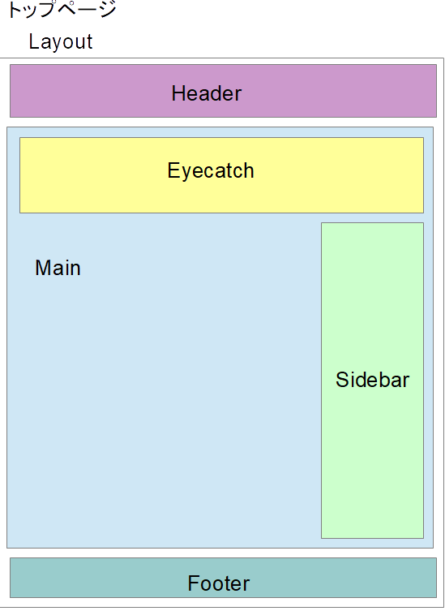
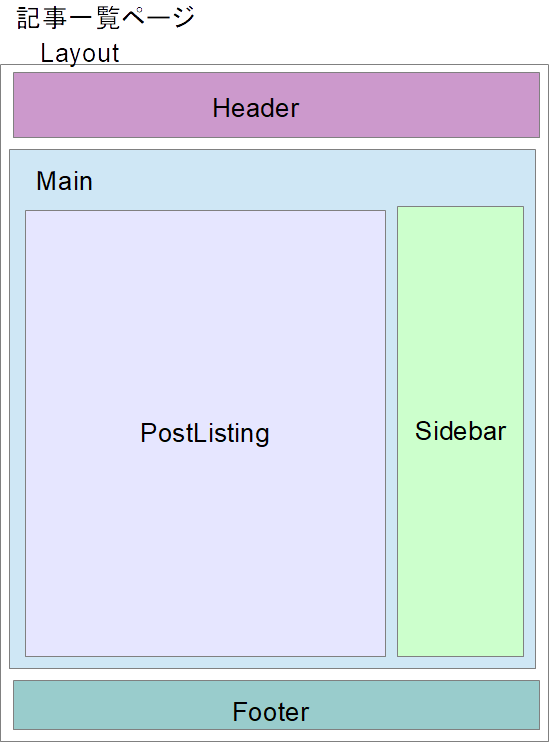
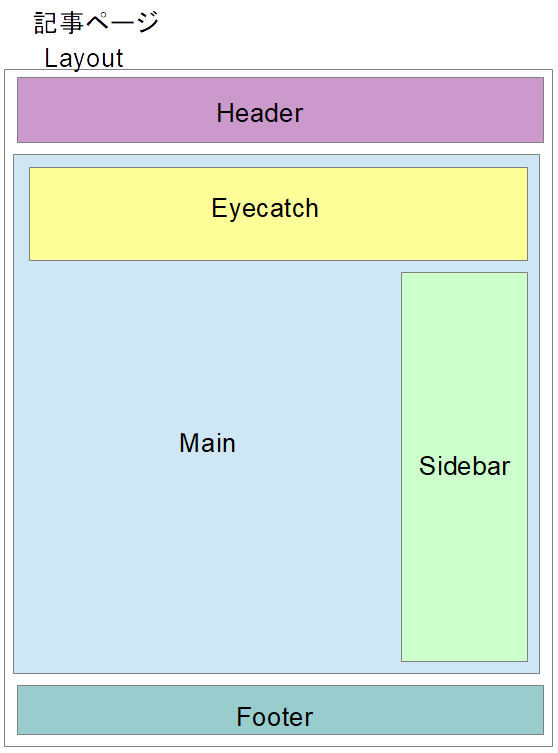

記事のレイアウトは、components/layout.jsで定義しています。
page定義のjで、
~~~
import Layout from "../components/layout"
~~~
により、Layoutコンポーネントをインポートし、以下のように使用していました。
~~~
<Layout location={location} title={siteTitle}>
   ...
   ページ記述のhtml
   ...
</Layout>
~~~
リッチな見栄えを定義するために、Layoutに加え、以下のコンポーネントを追加しました。

|コンポーネント|機能|
|:--|:--|
|Layout|ページの共通枠|
|Header|メニューを持つページヘッダ|
|Footer|ページフッダ|
|Main|ページの構成定義|
|Eyecatch|アイキャッチ画像表示用|
|Sidebar|サイドバーの定義|
|PostListing|記事一覧ページの定義|

トップページのレイアウトと構成コンポーネントはこんなかんじです。

記事一覧ページ（カテゴリ別、タグ別、投稿月別の記事一覧）のレイアウトと構成コンポーネントはこんなかんじです。

記事本文ページのレイアウトと構成コンポーネントはこんなかんじです。

## Layoutコンポーネント

Layoutでは、構成要素のHeader, Footer, Eyecatch, Main, Sidebarの配置を定義しています。

~~~js:title=gatsby/app/src/components/layout.js
import React from "react"

import "./layout.css";
import "prismjs/themes/prism.css"
import Main from "./Main"
import Eyecatch from "./Eyecatch"
import Sidebar from "./Sidebar"
import Header from "./Header"
import Footer from "./Footer"

const Layout = ({ location, title, avatar, children }) => {
  const rootPath = `${__PATH_PREFIX__}/`
  let main

  if (location.pathname === rootPath) {
    main = (
      

        <Eyecatch title={title} image={avatar}/>
        <Main sidebar={<Sidebar/>}>{children}</Main>
      

    )
  } else{
    main = (
      <Main sidebar={<Sidebar/>} avatar={avatar}>
        {children}
      </Main>
    )
  }
  return (
    

      <Header/>
      {main}
      <Footer/>
    

  )
}

export default Layout
~~~

## Headerコンポーネント

Headerでは、ヘッダメニューを定義しています。
本サイトでは、メニューバー左からHome, Articles, Recipe, Aboutの4メニューアイコンを常時表示し、
ページ幅が狭いときは、メニューバー右端に、ドロワー形式のサイドバーを制御するハンバーガーアイコン
を表示しています。

マウス移動の応答や、メニューの動きは、header.cssで定義しています。

~~~js:title=gatsby/app/src/components/Header.jsx
import React from "react"
import { Link } from "gatsby"
import Sidebar from "./Sidebar"
import "./header.css";

const Header = () => {
  const LinkStyles = {
    textDecoration: 'none',
    boxShadow: 'none',
    marginBottom: '0',
    height: '40px',
    padding: '0',
  }

  let header
  header = (
      <header class="site-header">
        <ul class="menu">
          <li class="menu__home">
            <Link style={LinkStyles} activeStyle={LinkStyles} class="menu-link" to="/">
              
            </Link>
          </li>
          <li class="menu__single">
             
             <ul class="menu__second-level">
               <li><Link class="menu-link" to="/categories/all">All</Link></li>
               <li><Link class="menu-link" to="/categories/">Categories</Link></li>
               <li><Link class="menu-link" to="/archives/">Archives</Link></li>
               <li><Link class="menu-link" to="/tags/">Tags</Link></li>
             </ul>
          </li>
          <li class="menu__none">
            <Link style={LinkStyles} activeStyle={LinkStyles} class="menu-link" to="/Site_Recipe">
              
            </Link>
          </li>
          <li class="menu__none">
            <Link style={LinkStyles} activeStyle={LinkStyles} class="menu-link" to="/about">
              
            </Link>
          </li>
          <li class="menu__right">
            

              <input type="checkbox" id="nav_input" class="nav_unshown"/>
              <label for="nav_input" id="nav_open">
                
                
                
              </label>
              <label for="nav_input" class="nav_unshown" id="nav_close"></label>
              

                <Sidebar/>
              

            

          </li>
        </ul>
      </header>
  )
  
  return (
      <header>{header}</header>
  )
}

export default Header
~~~

## Mainコンポーネント

Mainコンポーネントは、アイキャッチ画像、マークダウンで記述した記事コンテンツ、サイドバーを束ねています。

~~~js:title=gatsby/app/src/components/Main.jsx
import React from "react"
import "./main.css";

export default ({ children, sidebar, avatar }) => (
  

    
{avatar}

    

       

         
{children}

       

       

         
{sidebar}

       

    

  

)
~~~

各要素の配置はmain.cssで定義しています。モバイル端末のようなページ幅が一定価以下の場合は、
サイドバーは表示しないようにしています。代わりに、Headerコンポーネントでサイドバーを
ドロワーとして表示できるようにしています。

## Sidebarコンポーネント

以下を参考に実装しました。

https://qiita.com/okumurakengo/items/c34aa980afec9957a928 
GatsbyjsでWordPress風の簡易ブログを作って勉強してみた

Sidebarには、直近の5件の記事へのリンク、カテゴリ別記事一覧へのリンク、投稿月別記事一覧へのリンクが
含まれます。これらを取得するクエリが必要になります。
Sidebar.jsx中に、recentlyAllMarkdownRemark, categoriesAllMarkdownRemarkと別名を付けた
２つのクエリを定義しています。recentlyAllMarkdownRemarkで直近の5件の記事のタイトルと要約を取得し、
categoriesAllMarkdownRemarkでは、全件のカテゴリと投稿日時を取得しています。
カテゴリと投稿日時はSet()で集約し、カテゴリ別記事と投稿日時別記事のリンクリストを生成し
Sidebarページのhtmlに埋め込んでいます。

~~~js:title=gatsby/app/src/components/Sidebar.jsx
import React from "react"
import { useStaticQuery, Link, graphql } from "gatsby"
import "./sidebar.css";

export default () => {
  const {
    recentlyAllMarkdownRemark: { edges: recentlyBlogs },
    categoriesAllMarkdownRemark: { edges: allBlogs },
  } = useStaticQuery(
    graphql`
      query {
        recentlyAllMarkdownRemark: allMarkdownRemark(
          sort: { fields: [frontmatter___date], order: DESC }
          limit: 5
        ) {
          edges {
            node {
              frontmatter {
                title
              }
              fields {
                slug
              }
            }
          }
        }
        categoriesAllMarkdownRemark: allMarkdownRemark (
          sort: { fields: [frontmatter___date], order: DESC }
          limit: 1000
        ) {
          totalCount
          edges {
            node {
              fields {
                slug
              }
              frontmatter {
                title
                category
                year: date(formatString: "YYYY")
                month: date(formatString: "MM")
                description
              }
            }
          }
        }
      }
    `
  )

  // Make catgory list
  const categorySet = new Set();
  allBlogs.map((edge) =>{
    const {frontmatter} = edge.node
    categorySet.add(frontmatter.category)
  })
  const category_list = Array.from(categorySet.values()).map((category) =>
    <li class="sidebar-listitem"><Link class="sidebar-link" to={`/categories/${category}`}>{category}</Link></li>
  );

  // Make monthly archive list
  const monthlySet = new Set();
  allBlogs.map((edge) =>{
    const {frontmatter} = edge.node
    monthlySet.add(`${frontmatter.year}/${frontmatter.month}`)
  })
  const monthly_list = Array.from(monthlySet.values()).map((monthly) =>
    <li class="sidebar-listitem"><Link class="sidebar-link" to={`/archives/${monthly}/`}>{monthly}</Link></li>
  );

  return (
    <>
    
      

        <h4 class="sidebar-h4">最近の記事</h4>
        <ul class="sidebar-list">
          {recentlyBlogs.map(
            ({
              node: {
                frontmatter: { title },
                fields: { slug },
              },
            }) => (
              <li class="sidebar-listitem">
                <Link class="sidebar-link" to={slug}>{title}</Link>
              </li>
            )
          )}
        </ul>
      

      

      

        <h4 class="sidebar-h4">カテゴリー</h4>
        <ul class="sidebar-list">
          {category_list}
        </ul>
      

      

      

        <h4 class="sidebar-h4">月別記事</h4>
        <ul class="sidebar-list">
          {monthly_list}
        </ul>
      

      

    </>
  )
}
~~~

